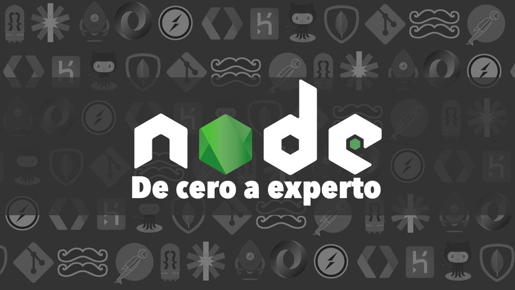

  <h1>Nodejs: De cero a experto</h1>
  
  <h3 style="font-weight:bold;" >Curso FH - Node.js: De cero a experto (29H)</h3>
  <h5></h5>

## Requisitos :clipboard:

* Conocimiento básico de JavaScript es necesario
* Conocimiento básico de programación es necesario
* Poder realizar instalaciones en el equipo como administrador
* Se puede lanzar el contenido del curso en OSX (Mac), Windows o Linux.
* Conocimiento de ECMA6 mínimo requerido.
* Conocimiento de Git necesario.
* **Nota :** prework usado **WebStorm**

## Comenzando 🚀

En este curso se desplegara en github los ejemplos sin llaves privadas que puedan ser usadas para desplegar otros servicios anexos a el.

Todos los proyectos seras usados por objetos exportables y ignorados a la hora de subirse en el .gitignore 

Las api utilizas de GCP seran modificadas al finalizar las secciones. 👌

## Descripción :notebook:

**Aprender Node.js 02-2022**

Este curso tiene por objetivo llevarte de cero conocimiento de Vue hasta un nivel competitivo en el ambiente laboral de hoy en día. Este curso está construido 100% en js funcional y componentes.

## Listado de Temas del Curso: 💯

    *   Sc01 - Introduccion
    *   Sc02 - Fundamentos de Nodejs
    *   Sc03 - Reforzamiento de los temas necesarios para seguir el curso
    *   Sc04 - Bases de Nodejs
    *   Sc05 - Aplicacion de consola interactiva - Tareas por hacer...
    *   Sc06 - Aplicacion de clima
    *   Sc07 - Webserver - Http - Express - Hbs
    *   Sc08 - Rest Server - Config Init
    *   Sc09 - Rest Server - Colecciones de Usuarios
    *   Sc10 - Rest Server - Jwt
    *   Sc11 - Rest Server - GCP Front & Back
    *   Sc12 - Rest Server - Categorias y Productos
    *   Sc13 - Rest Server - Upload file´s & proteccion
    *   Sc14 - Socket´s - Fundamentos
    *   Sc15 - Socket´s - Aplicaciones de cola
    *   Sc16 - Socket´s - Auth
    *   Sc17 - Node + Tp - Mysql
    *   Sc18 - Final
    *   Sc19 - Bonus - Socket Chat